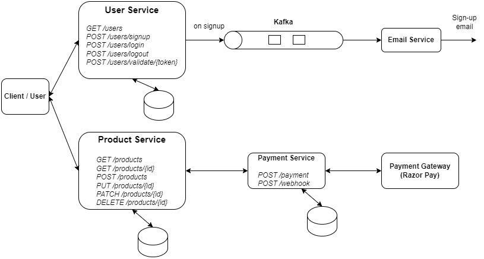

[E-Commerce System Design]

Email service deals with the sending email updates to users upon sign-up in the e-commerce application. Further, this same service could be used to send various updates related to Order placement, individual notifications about the order updates, payment notifications etc. It integrates with Third-Party email providers like Google Gmail to send the email updates.

Primary functionalities provided by the Email Service:
a.	Welcome email upon new user sign-up
b.	Email updates about the order processing stages
